| 实验课程：计算机网络实践      | 姓名：李彤         | 学号：10235101500 |
| ----------------------------- | -------------------- | ----------------- |
| 实验名称：Lab01 Protocol Layer | 实验日期：2021.11.15 | 指导老师：王廷  |

----
### 实验目的

- 学会通过Wireshark获取各协议层的数据包
- 掌握协议层数据包结构
- 分析协议开销

### 实验内容与实验步骤

- 获取协议层的数据包
- 绘制数据包结构
- 分析协议开销
- 分析解复用键
- 思考题

### 实验工具

- Wireshark
- wget

### 实验过程及分析
#### 1. 获取协议层数据包
打开命令行后，输入 **wget http://www.baidu.com** ，能观察到 **200 OK** 。           
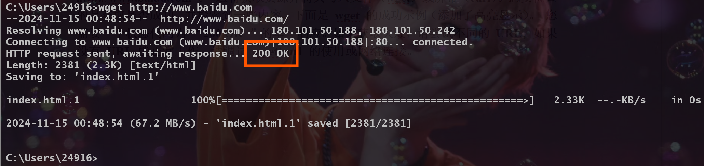
验证完成后，就可以使用Wireshark了。         

打开Wireshark后，我这里选择了 **WLAN接口** ，然后设置捕获过滤器为 **tcp port 80** ，并勾选 **enable network name resolution** 选项，现在就可以开始捕获了。                 

重新打开命令行，输入 **wget http://www.baidu.com** ，就能看到Wireshark开始捕获了。这里我们先选中查看协议为HTTP，信息为GET的数据包。      
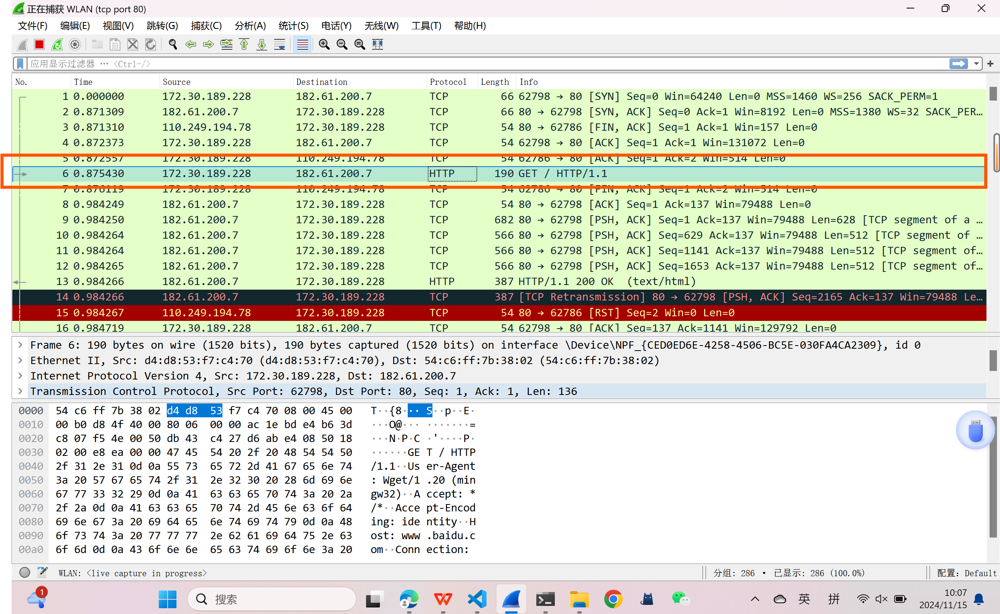
通过点击上层的每一个协议，我们可以查看这些协议所对应的数据帧的范围。 ~~（清楚这一点将有利于我们后面的分析）~~   
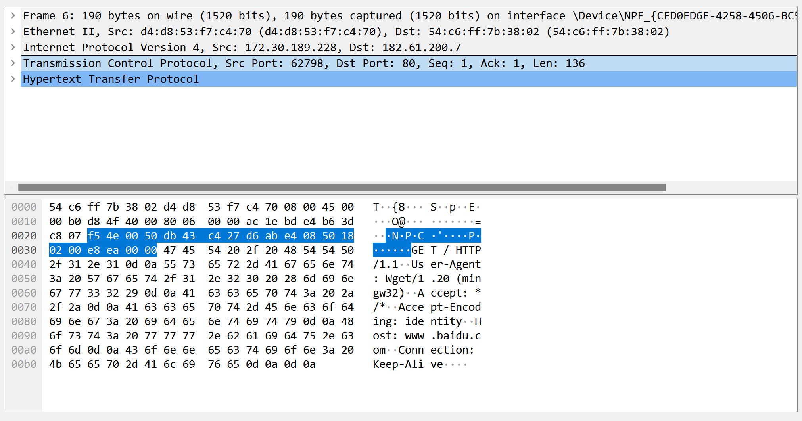
再选取一个协议为HTTP，信息含有200 OK的数据包，将其与刚才的数据包进行比较，可以发现这个数据包多了两个额外数据块。
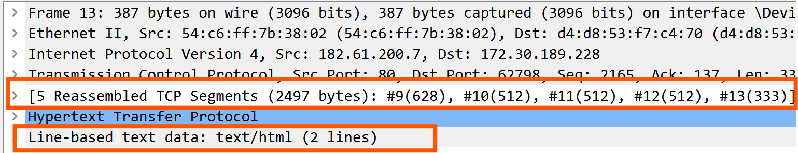

#### 2. 数据包协议分析
利用Wireshark，我们可以继续细化对协议的划分，像下面这样，点击Ethernet的Destination字段，就可以看到相对应的字节，从而对协议的结构进行分析。
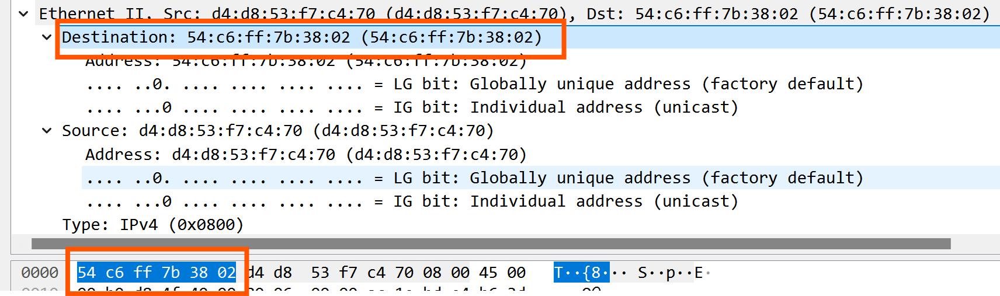
经过上面的操作，我们可以得到下面的图。整体来看， **Ethernet协议共有14字节，IPV4和TCP均有20字节，HTTP有130字节** 。
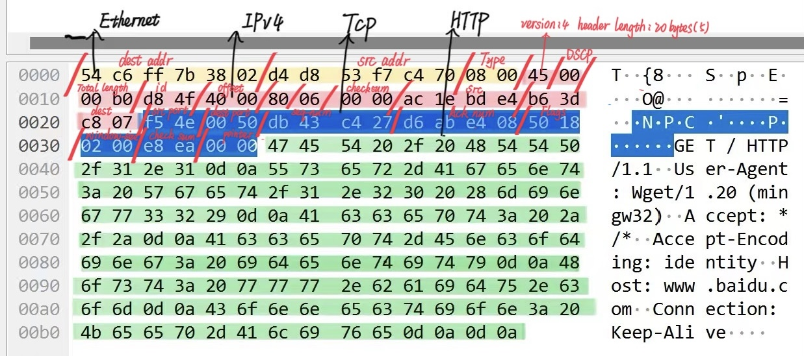
因为低层协议在 “线上 ”的数据包中排在前面，所以数据包的结构应该是

#### 3. 分析协议开销
根据指导可知，下载的包从一个带有[SYN,ACK]的数据包开始，结束于第一个HTTP包后的TCP包。因此下载的包也就是图中的数据包2-5，一共四个数据包，其中三个TCP包，一个HTTP包。
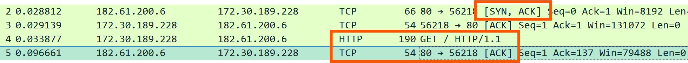
打开每个TCP包中查看内容，我们可以看到这些数据包没有HTTP字段，因此这些包的所有字节都属于开销，根据前面的分析我们知道，一个数据包中Ethernet、IPV4和TCP分别有14、20、20个字节，因此一般情况下一个数据包中的开销就是**14 + 20 + 20 = 54字节** ~~（要注意第一个TCP包的开销是66字节）~~
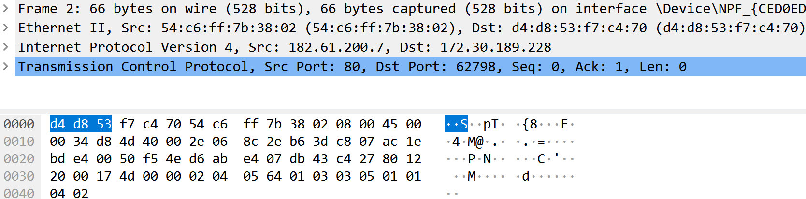
所以协议的总开销就是 
$$
（66 + 54 * 3） / （66 + 54 * 2 + 190） = 61.29% 
$$
不得不说开销还是蛮大的，但这种开销又是必要的，因为它们包含了目标端源端段地址等以及校检和等重要信息，所以万万不能够舍去。

#### 4. 分析解复用键
通过查看Ethernet的报文，可以发现唯一与IP相关的就是Type字段，因此 **Type字段** 是解复用关键字，它用值 **0x0800** 告诉我们下一层是IP。
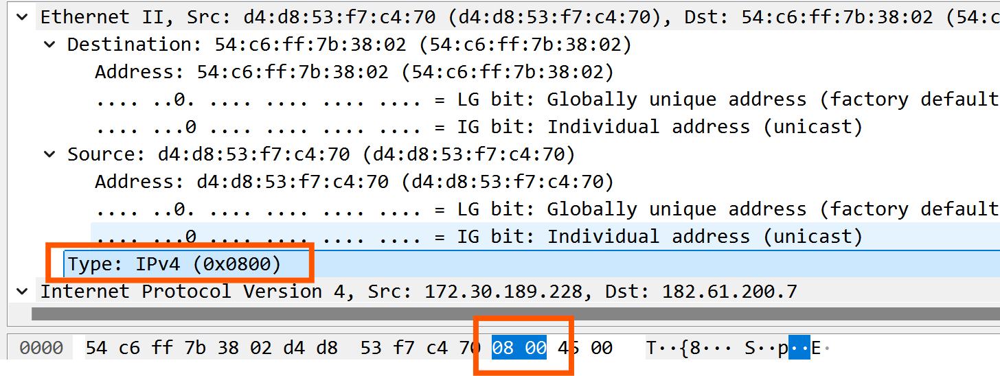
同理，我们查找IP的报文可以知道 **Protocol字段** 是解复用密钥，他用值 **6** 告诉我们下一层是TCP。
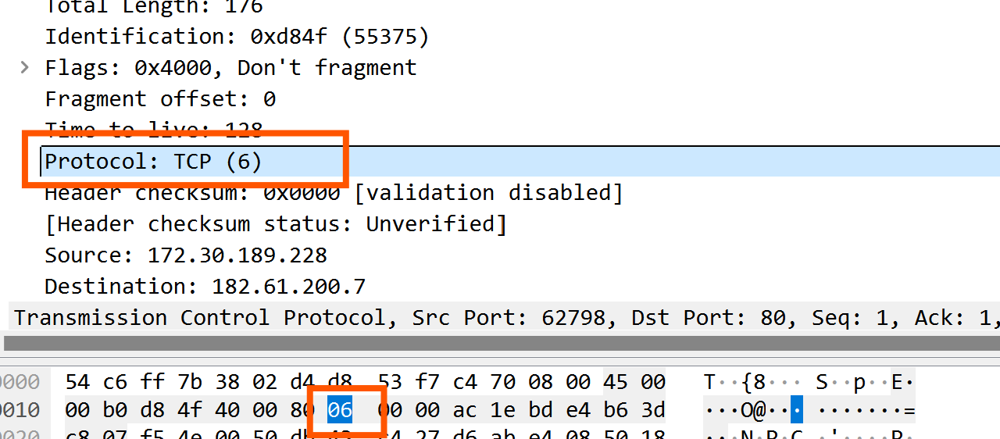

#### Explore
* Look at a short TCP packet that carries no higher-layer data. To what entity is this packet destined? After all, if it carries no higher-layer data then it does not seem very useful to a higher layer protocol such as HTTP!            
**ans:** 通过查看每一个数据包的src和dest列，我们可以发现其ip地址主要为 **172.30.189.228和182.61.200.7** ，而这两个ip地址分别是我的WLAN 和 网站 http://www.baidu.com 的ip地址，因此以包2为例，这个包的dest ip地址为172.30.189.228，因此其目的地的实体就是我的WLAN接口。
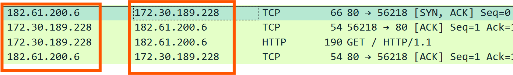
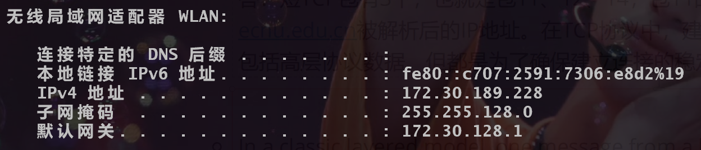
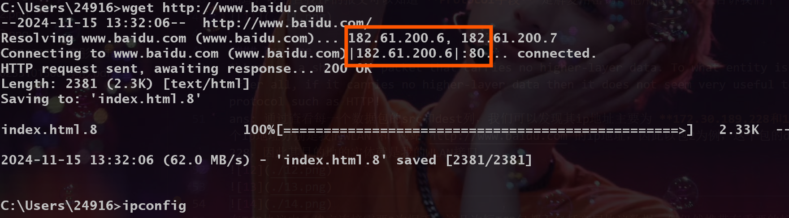
在TCP协议中，建立连接需要3次握手，这几次短TCP包都不包括高层协议数据，但仍然携带有重要的控制信息，这些控制信息对于确保数据的可靠传输和连接的正常状态至关重要。       

* In a classic layered model, one message from a higher layer has a header appended by the lower layer and becomes one new message. But this is not always the case. Above, we saw a trace in which the web response (one HTTP message comprised of an HTTP header and an HTTP payload) was converted into multiple lower layer messages (being multiple TCP packets).  Imagine that you have drawn the packet structure (as in step 2) for the first and last TCP packet carrying the web response.  How will the drawings differ?             
**ans:** 两个数据包报文头的部分应该都差不多，其差异主要体现在数据段。第一个TCP包的话肯定要包含HTTP的报文头，可能会携带部分HTTP的有效载荷，并包含一些字段表示后面还有数据；最后一个TCP包可能含有最后的有效载荷数据，还可能会有一些标识符信息表示数据传输结束。

* In the classic layered model described above, lower layers append headers to the messages passed down from higher layers. How will this model change if a lower layer adds encryption?            
**ans:** 如果低层对数据进行了加密，那么高层肯定要有相应的解密功能。要实现可能需要添加相应的加密协议和加密字段。这种方式虽然保证了数据传输的安全性，但同时也增大了协议的开销和操作的复杂度。

* In the classic layered model described above, lower layers append headers to the messages passed down from higher layers. How will this model change if a lower layer adds compression?           
**ans:** 同理，如果低层对数据进行了压缩，那么高层也应该有相应的解压缩功能。因为其他字段都携带了重要信息，所以压缩的话应该是对数据部分进行压缩，这样我们传输的数据就变成被压缩的有效载荷了。压缩可以有效减少数据传输的延迟和带宽占用，但也会引入额外的计算负担。