| 实验课程：计算机网络实践      | 姓名：李彤         | 学号：10235101500 |
| ----------------------------- | -------------------- | ----------------- |
| 实验名称：Lab02 Ethernet | 实验日期：2024.11.29 | 指导老师：王廷  |

### 实验内容与实验步骤

* 获取以太网的帧
* 分析以太网的帧
* 分析以太网的地址范围
* 分析以太网的广播帧
* 思考题

### 实验工具

- Wireshark
- ping

### 实验过程及分析
#### 1. 前期准备
照例打开Wireshark，根据实验手册可以知道，这里我连接的WLAN，使用icmp过滤，也能获得伪以太网头。然后在终端输入ping指令 `ping www.baidu.com` ，成功捕获到数据包。
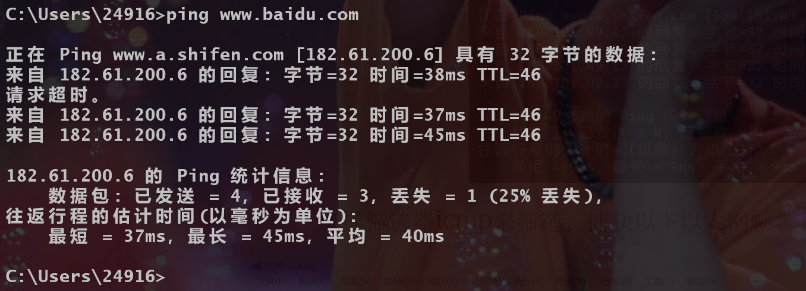
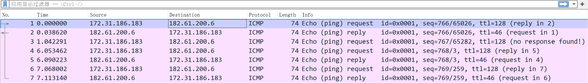

#### 2. Ethernet帧结构分析
点击第一个数据包，我们就可以查看这个包的详细信息，根据实验手册我们知道，在这个数据包中，前面14个字节是Ethernet报文头，后面60个字节是有效载荷（从Ethernet头后的IP开始，这里包括IP和ICMP）。点击上面的每一个部分，下面会高亮选择相应的字节，于是就可以继续细分帧结构。最后其实还有四字节的checksum在这个包中没有显示出来。 ~~（实验手册解释：“发送或接收帧的以太网硬件会计算或检查该字段，并添加或删除它。因此，在大多数捕获设置中，操作系统或 Wireshark 根本看不到它。”）~~ 
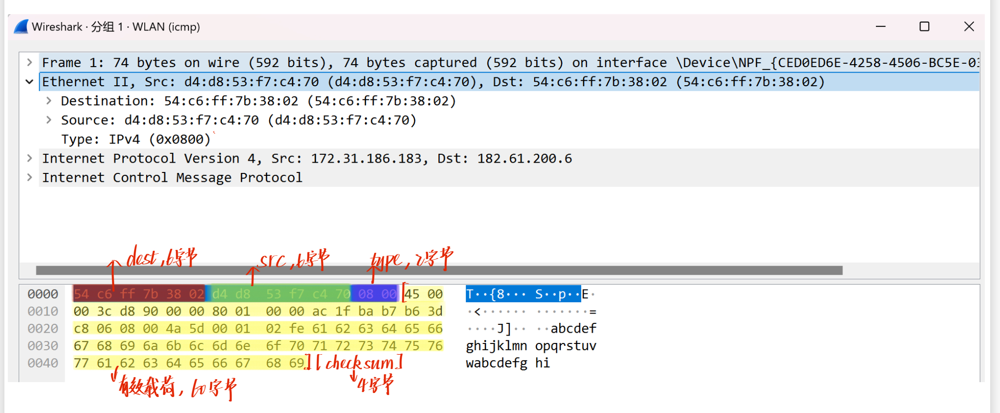
因此我们可以画出Ethernet的帧结构:
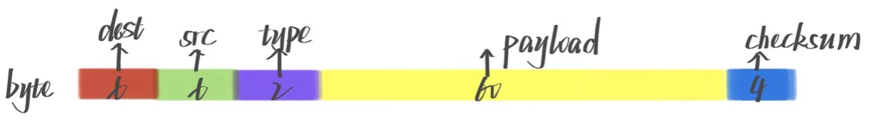

#### 3. Ethernet地址范围
根据实验手册可以知道以太网帧中的一个地址是我的 **计算机地址** ，结合终端ipconfig指令也可以发现，这里我的计算机地址是 `172.31.186.183` & `d4:d8:53:f7:c4:70` ，另一个地址则是 **路由器或默认网关的以太网地址** ，即 `54:c6:ff:7b:38:02`，这个设备连接了我的局域网和互联网。同时IP字段也记录了整体的源和目的端点，即我的计算机地址和远程服务器。          
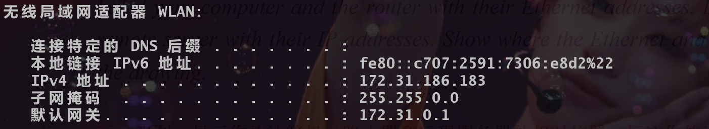

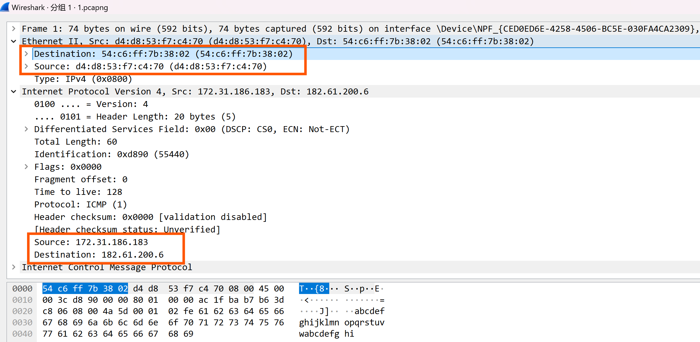
所以可以推测，计算机先是在局域网内连接到路由器，再由路由器连接到互联网的剩余部分，对应的结构如下：
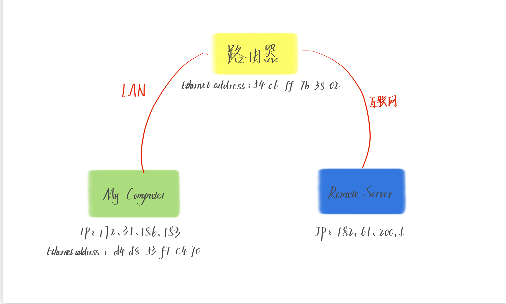

#### 4. 分析Ethernet广播帧
首先先将过滤器改为 `ether multicast`，捕获广播和组播以太网帧。      
##### 4.1       
这里选择广播帧1查看详细信息，我们可以发现address字段是`ff ff ff ff ff ff`。所以Wireshark 显示的广播以太网地址的标准格式是地址位全为 **1** 。
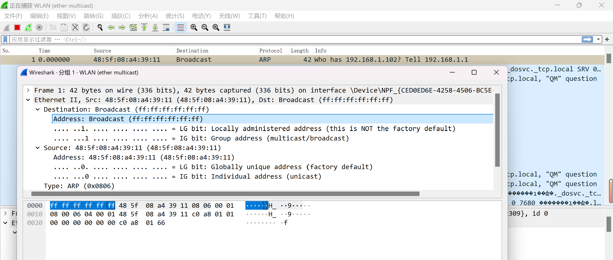
##### 4.2       
根据src和dest地址字段的区别我们可以发现，src **(unicast)** 的第八位是0，单播，而dest  **(multicast/broadcast)** 的第八位是1，所以我们可以推断以太网地址从左往右第八位用于确定是单播还是组播/广播（1 -> 组播/广播，0 -> 单播）。

#### 5. Explore
**这里尝试了很多办法都还是抓不到包，所以就找其他班的同学要了一份 ~~（老师发的）~~ 。**          
首先先用过滤器llc过滤出所有包，
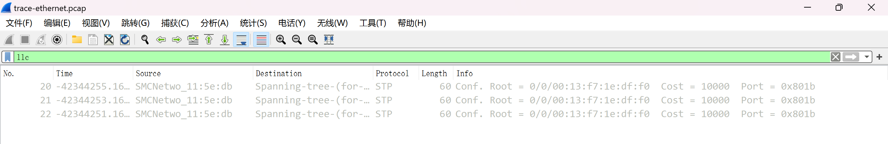
* How long are the combined IEEE 802.3 and LLC headers compared to the DIX Ethernet headers? You can use Wireshark to work this out. Note that the Trailer/Padding and Checksum may be shown as part of the header, but they come at the end of the frame.       
**ans：** 通过点击不同字段，我们可以找到其在下方对应的字节。因此，IEEE 802.3 和 LLC 的合并报头 = **14 + 3 = 17 字节** ，而我们知道前面的以太网报头是14字节，所以长了 **3字节** ，也就是LLC这一报头的长度。   
注：点击IEEE 802.3报文头，末尾高亮的字节只是一个零填充，避免帧太短。        
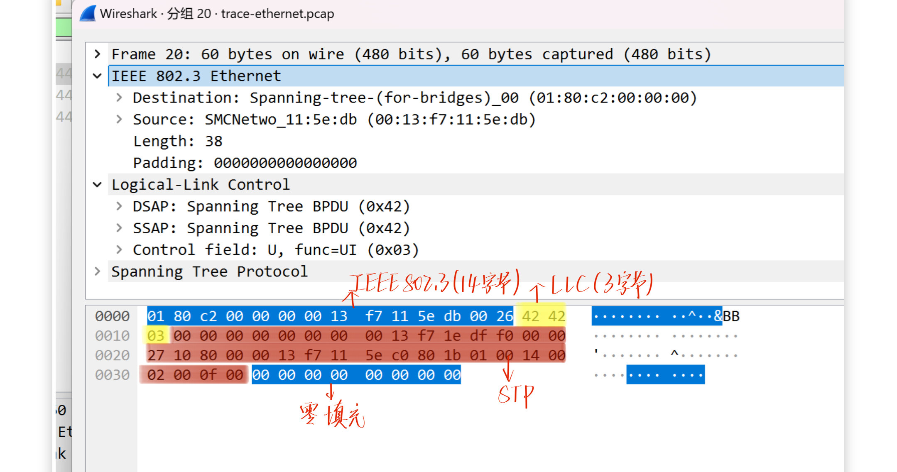

* How does the receiving computer know whether the frame is DIX Ethernet or IEEE 802.3? Hint: you may need to both use Wireshark to look at packet examples and read your text near where the Ethernet formats are described.        
**ans：** 如果第 13 和 14 字节的值大于 **0x0600** ，那么该帧是 DIX 以太网格式，并且第 13 和 14 字节被解释为 EtherType，表示上层协议类型；如果第 13 和 14 字节的值小于或等于 **0x05DC** ，则该帧是 IEEE 802.3 格式，并且这两个字节表示数据长度。

* If IEEE 802.3 has no Type field, then how is the next higher layer determined? Use Wireshark to look for the demultiplexing key.         
**ans：** 在IEEE802.3帧中，以太网中的类型字段被替换为一个长度字段，用于标明数据部分的长度。
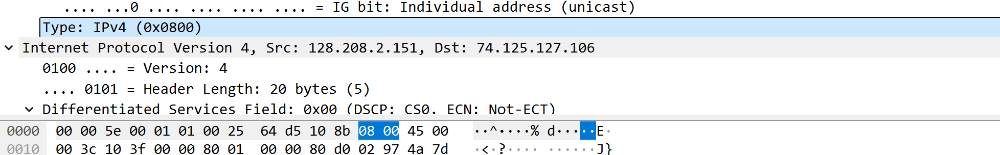
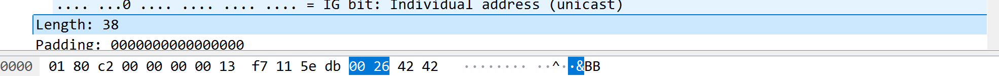
虽然没有了类型字段，但是802.3还是可以通过LLC子层来决定下一层协议。      
这里 **DSAP和SSAP就被用于标识协议类型** ，Control字段用来提供流控制信息。例如，这个包中DSAP字段的0x42就标识该帧使用Spanning Tree BPDU协议。
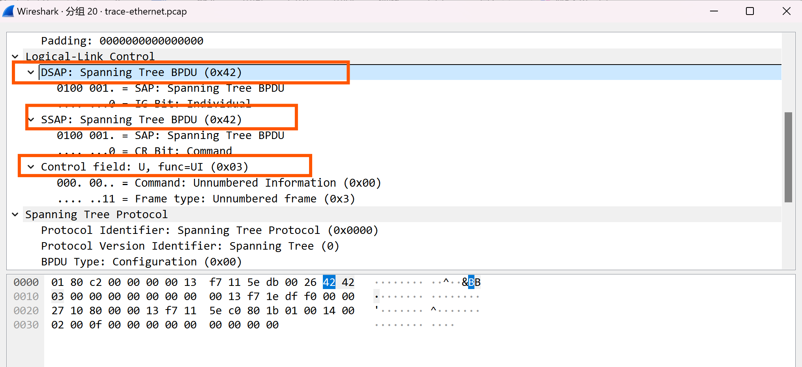