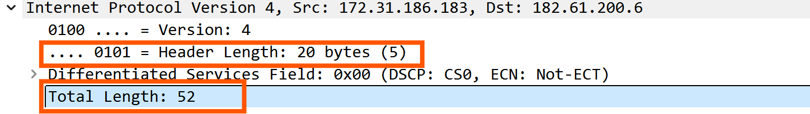

| 实验课程：计算机网络实践      | 姓名：李彤         | 学号：10235101500 |
| ----------------------------- | -------------------- | ----------------- |
| 实验名称：Lab03 IPV4 | 实验日期：2024.12.08 | 指导老师：王廷  |

----

## 实验目的

- 学会通过Wireshark分析ip协议
- 了解IP数据报的组成
- 了解IP各部分的含义

## 实验内容与实验步骤

- 捕获数据
- 数据分析
- 作业题
- 画出IP报文
- 画出网络路径
- 计算报文的校验和

## 实验环境

- Wireshark v2.0.2
- wget
- tracert（windows）

## 实验过程
### 前期调试
之前两个实验已经用过了wireshark和wget，这里就只展示一下tracert的使用。

### IPV4 结构分析
通过点击wireshark上层不同字段我们可以在下方看到对应的字节，因此可以画出IPV4的结构图

#### 作业回答
**1. What are the IP addresses of your computer and the remote server?**        
**ans：**           
这里我打开的是第一个包，所以本机地址对应的就是 **src** 字段，即 **172.31.186.183** （结合终端ipconfig指令结果也能验证这一点），而远程服务器地址对应的就是 **dst** 字段，即 **182.61.200.6** 。

 

**2. Does the Total Length field include the IP header plus IP payload, or just the IP payload?**      
**ans：**           
总长为52字节，IP报文头显示为20字节，我们点击TCP包发现其长度恰好为32字节，因此可以推断这个Total length应该是 **IP头和有效载荷** 的总和。

 

**3. How does the value of the Identification field change or stay the same for different packets? For instance, does it hold the same value for all packets in a TCP connection or does it differ for each packet? Is it the same in both directions? Can you see any pattern if the value does change?**          
**ans：**       
根据IPV4结构可以看出，Flag字段和Fragment Offset共用同一字段。     
因此结合实验手册推测：当上层数据包过大就会被拆分，拆分得到的小包共享相同的Flag值，然后设置Offset来确定每个小包的偏移量。            
所以不同的数据包的标识字段（Flag值）是不一样的，用于区分，且因为没有被拆分，所以其Offset值均为0；
如果一个数据包被拆分了，那么它拆分得到的小数据包的标识字段（Flag）就是相同的，表明它们来源于相同的数据包，然后Offset值则确定了每个小数据包的相对位置，这样可以确保按照原来的顺序接受。    

 

**4. What is the initial value of the TTL field for packets sent from your computer? Is it the maximum possible value, or some lower value?**       
**ans：**       
TTL的初始值是128，根据其位数可知其最大值应当为255（0xff），所以这只是一个较低值。       

 

**5. How can you tell from looking at a packet that it has not been fragmented? Most often IP packets in normal operation are not fragmented. But the receiver must have a way to be sure. Hint: you may need to read your text to confirm a guess.**       
**ans：**       
观察Flag和Fragment Offset字段我们可以发现一个 **Don't Fragment** 提示信息，这说明这个数据包没有被拆分。因为Flag肯定是用来区分不同数据包的，所以应该是由Fragment Offset字段来标志数据包有没有被拆分，如果Fragment Offset的值为0，那就说明没有被拆分，否则就是被拆分了。      

 

**6. What is the length of the IP Header and how is this encoded in the header length field? Hint: notice that only 4 bits are used for this field, as the version takes up the other 4 bits of the byte. You may guess and check your text.**          
**ans：**       
wireshark显示version和Header Length共用同一个字节。这里我们可以看到Header Length的值为5（0101），但是报文头的长度却显示为20（？？？），思考后猜测这里应该是version占据该字节的低4位，Header Length占据高4位，所以真正的报文头长度应该是Header Length的位值再乘以4，即 **5 * 4 = 20**，同时我们也可以推出报文头的最大取值为60字节（0xf = 15）。      

### 网络路径
 ~~前面tracert的跳数太多了，所以换了一个少一点的~~          
根据实验手册可知，在IP数据包的源IP地址和目的IP地址之间的网络路径上还有很多的IP路由器。数据包从源IP地址出发，不断在对应的网络路径上的IP路由器上跳跃，最终跳到目的IP地址上。并且每次跳跃的时候，数据包都会向目的地址发出响应。            
这里我们借助tracert工具输出跳跃路径上路由器的IP地址，从而画出IP数据包的网络路径。      

**172.31.186.183（源IP地址，即本机地址）-> 10.100.4.1 -> 10.10.9.2 -> 10.200.102.3 -> 10.200.104.1 -> 202.120.92.60（目的IP地址，即www.ecnu.edu.cn的IP）**

 

### IP头校验和
因为校验的是远程服务器发送给本机地址的数据包，所以这里换了一个包

1. 将IP头两两字节一组分为10组，得到每组值分别为： **0x4500、0x0034、0x6083、0x4000、0x2e06、0x0726(checksum)、0xb63d、0xc806、0xac1f、0xbab7**        
2. 相加得到和为**0x3fffc**，再将3加到低位得到**0xffff**

3. 因为前面求和已经加上了校验码（0x0726），所以这里只需要对**0xffff**取反即可，得到结果为**0**，校验和为0，所以校验通过，可以接受该数据包。