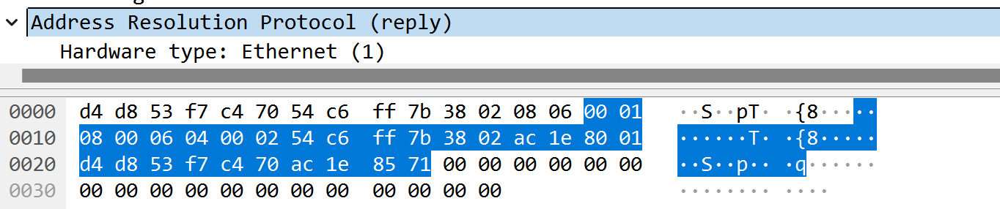

| 实验课程：计算机网络实践      | 姓名：李彤         | 学号：10235101500 |
| ----------------------------- | -------------------- | ----------------- |
| 实验名称：Lab04 ARP | 实验日期：2024.12.13 | 指导老师：王廷  |

----

### 实验目的

- 通过Wireshark获取ARP消息
- 掌握ARP数据包结构
- 掌握ARP数据包各字段的含义
- 了解ARP协议适用领域

### 实验内容与实验步骤

- 捕获ARP数据包
- Q&A

### 实验工具/指令

- Wireshark
- ipconfig/all
- netstat -r
- arp -a / arp -d

## 实验步骤
### 前期准备
&emsp;&emsp; **ipconfig/all** 结果展示

 

&emsp;&emsp; **netstat -r** 指令查找 **0.0.0.0** 目的地对应的网关IP地址为 **172.30.128.1**

 

&emsp;&emsp;打开wireshark设置捕获过滤器为 **arp** ，然后再以管理员身份在终端分别输入 **arp -a、arp -d** 指令清除arp缓存中的默认网关。

 

&emsp;&emsp;再在浏览器中随机打开一个网页，就能开始抓包了。 ~~（这里我打开的网页是学校的公共数据库）~~           

### 请求和应答流程
&emsp;&emsp;可以看到帧2是请求默认网关MAC地址的帧， ~~因为它的描述信息里有 **"Who has ..."** 语句~~ ，接下来我们将对这个帧进行分析。

 

&emsp;&emsp;根据帧2的结构我们可以知道，这个数据包是由我的计算机发送给默认网关的。     

 

&emsp;&emsp;因为发送方不知道目标的MAC地址，所以这里Target的MAC地址全为 **00:00:00:00:00:00** ，当原本的Target变成发送方时，又会把自己的MAC地址加上，所以这样一来一回发送方和接收方的MAC地址和IP就都能知道了。         
&emsp;&emsp;结合前面的分析，帧3应该就是默认网卡的回复帧，点开以后可以看到它的MAC地址是 **54:c6:ff:7b:38:02**

 

&emsp;&emsp;所以整个流程大致如下：          

### Q&A
**1.What opcode is used to indicate a request? What about a reply?**            
**ans：** 结合帧2和帧3的结构我们可以发现，当opcode的值， **1表示请求，2表示回复** 。            

 

**2.How large is the ARP header for a request? What about for a reply?**        
**ans：** 请求头和回复头的大小都是 **28字节** 。

 

**3.What value is carried on a request for the unknown target MAC address?**        
**ans：** 根据前面分析可以知道未知目标的MAC地址的值为 **00:00:00:00:00:00** 。

 

**4.What Ethernet Type value which indicates that ARP is the higher layer protocol?**        
**ans：** 值 **0x0806** 表示ARP是上层协议。

 

**5.Is the ARP reply broadcast (like the ARP request) or not?**        
**ans：** 如图所示帧3和帧13都是回复帧，但它们都不是广播，因此回复帧不会广播，只有请求帧会广播。         

&emsp;&emsp;通过Ethernet头的type字段我们也可以确认这一点——回复帧是一个ARP类型，不是广播类型。      

### Explore
&emsp;&emsp;这里我又点开了一个目的地址为broadcast的帧，可以看到这里它的Is gratuitous字段被设置为True，说明该帧是一个无偿帧。我们可以看到他的源IP地址和目的IP地址都是 **0.0.0.0** ，目的MAC地址为 **ff:ff:ff:ff:ff:ff** 表明这个帧是广播帧。发送者就是具有 **MAC 地址 46:1b:41:d0:81:95** 的设备。

 

&emsp;&emsp;接着点开另一个帧，这个帧是由我的计算机发送的，根据Is gratuitous字段和Is announcement字段我们可以知道这是一个无偿的ARP公告。
目的是通知网络其他设备该设备的IP地址和MAC地址映射，它并不要求目标设备回应，它只是用来更新网络中其他设备的ARP缓存。
