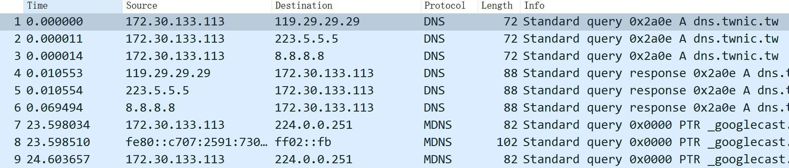
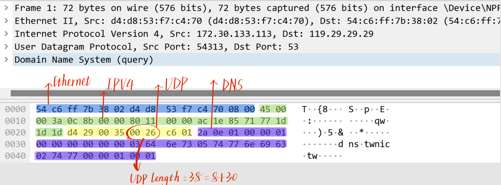
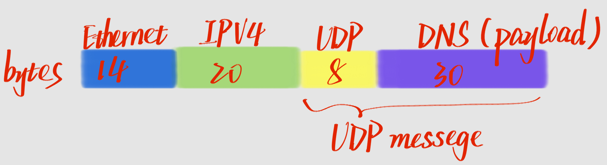
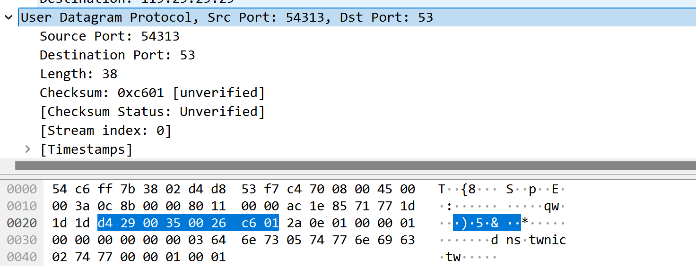
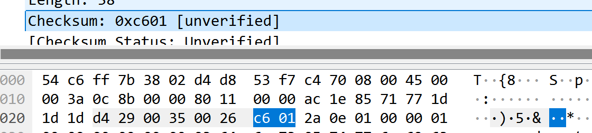
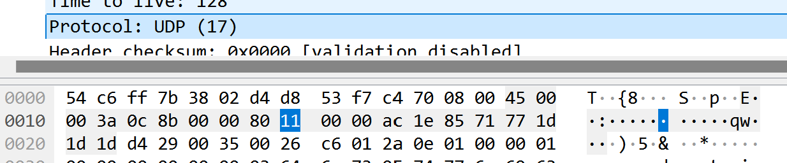
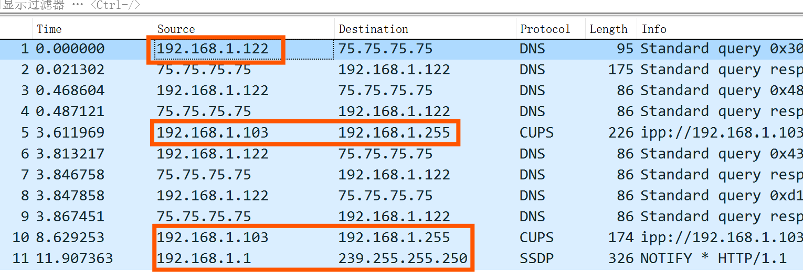
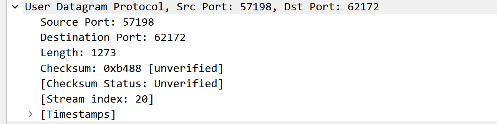
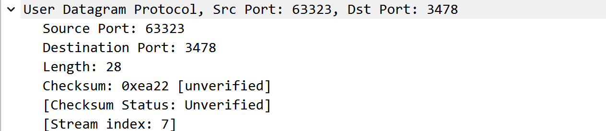
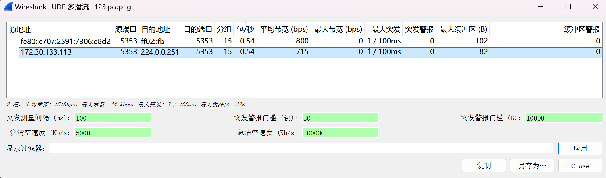

| 实验课程：计算机网络实践      | 姓名：李彤         | 学号：10235101500 |
| ----------------------------- | -------------------- | ----------------- |
| 实验名称：Lab05 UDP | 实验日期：2024.12.20 | 指导老师：王廷  |

-------

### 实验目的

- 学会通过Wireshark获取UDP消息
- 掌握UDP数据包结构
-  掌握UDP数据包各字段的含义
- 了解UDP协议适用领域

### 实验内容与实验步骤

- 获取UDP信息
- 分析UDP包
- 深入分析UDP包
- 思考题

### 实验工具

- Wireshark
- Windows操作系统
- Browser

## 实验步骤
### 前期准备
&emsp;&emsp;将捕获过滤器设置为 **udp** 后，打开浏览器浏览一个不常用的网页 ~~这里我浏览的是www.bilibili.com~~
然后就可以捕获到UDP啦

### UDP结构
&emsp;&emsp;这里我选择了第一个帧，点击不同字段获取其对应的字节我们可以知道， **以太网头有14个字节，IPV4有20个字节，UDP为8字节，而DNS则为30字节** 。

&emsp;&emsp;所以UDP报文结构如下：

### Q&A
**1.What does the Length field include? The UDP payload, UDP payload and UDP header, or UDP payload, UDP header, and lower layer headers?**             
**ans：** 我们可以看到UDP报文头中的length字段值为38，而 **38 = 8 + 30** ， 所以长度字段包括UDP报头和UDP有效载荷。           

 

**2.How long in bits is the UDP checksum?**             
**ans：** UDP报头中checksum的长度是 **4 * 4 = 16（bits）**

 

**3.How long in bytes is the entire UDP header?**             
**ans：** 整个UDP报头长就是 **8bytes** 。

### UDP Usage
**1.Give the value of the IP Protocol field that identifies the upper layer protocol as UDP.**             
**ans：** IP包头的 **Protocol字段的值为0x11（17）** 时，代表下一层协议是UDP。    
   

 

**2.Examine the UDP messages and give the destination IP addresses that are used when your computer is neither the source IP address nor the destination IP address. (If you have only your computer as the source or destination IP address then you may use the supplied trace.)**             
**ans：** 因为这里我所有的UDP包都有本机地址作为源IP地址或者目的IP地址，所以就用了现有的追踪。           
根据帧1我们可以知道这个追踪中 计算机的地址为 **192.168.1.122** ，所以可以发现这次跟踪中 **帧5、10、11** 的源IP地址和目的IP地址都不是计算机的地址，而这些帧的目的地址分别为 **192.168.1.255、192.168.1.255、239.255.255.250**

 

**3.What is the typical size of UDP messages in your trace?**             
**ans：** 筛选排序后，查看每个帧中UDP报文头中的length字段值可知，UDP报文的典型大小为 **1273字节** ，50%左右帧的UDP length都是这么大。同时也有很多帧的UDP报文长度很短，只有 **不到300字节** 。

### Explore
&emsp;&emsp;打开wireshark中的统计->UDP多播流进行查看。            
&emsp;&emsp;这两行数据分析了两个 mDNS 服务的 UDP 多播流量，第一个使用 IPv6 地址，第二个使用 IPv4 地址。
它们的包数和包速率差不多，都是低带宽、稳定的流量，没有明显的带宽波动或突然的流量峰值，也没有出现缓冲区警告。
数据包的大小较小，最大缓冲区分别是 102 字节和 82 字节。
总体来说，这些多播流量用于局域网内的设备发现（比如 mDNS），传输平稳，没有丢包问题。              

 

&emsp;&emsp;实时视频和语音（比如视频会议、直播、VoIP）通常使用UDP，因为它能减少延迟，尽管这样可能会丢失一些数据。比如RTSP、RTP和WebRTC就是基于UDP的。
而像Netflix、YouTube这样的点播视频和音频应用，则使用TCP，因为它更可靠，能确保数据传输不丢失。实时游戏、语音通话和会议（如Skype、Zoom、Fortnite）
也偏向使用UDP，以保证即时反馈和快速响应。对于一些需要确保数据完全准确的应用，如远程控制和公司内部数据传输，TCP则更合适。

 

&emsp;&emsp;这里我也在慢慢摸索wireshark的更多功能，比如在统计这一工具我们可以了解每一次捕获的详细信息，如丢包、传输速率、包大小等等。