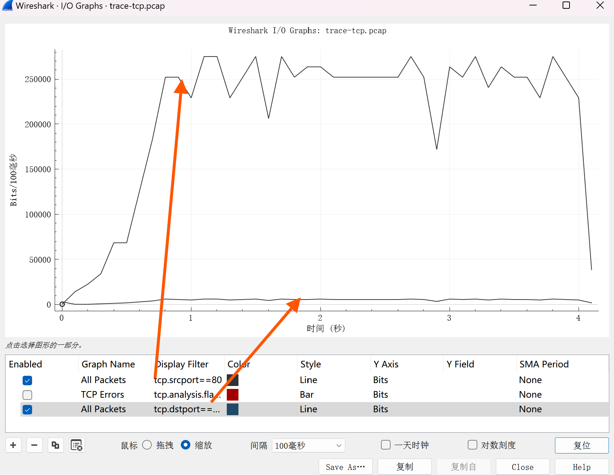

| 实验课程：计算机网络实践      | 姓名：李彤         | 学号：10235101500 |
| ----------------------------- | -------------------- | ----------------- |
| 实验名称：Lab06 TCP | 实验日期：2024.12.27 | 指导老师：王廷  |

----

## 实验步骤
###  前期准备
&emsp;&emsp;打开wireshark，将端口设置为 **tcp and host www.ecnu.edu.cn** （发现tcp and host ecnu.edu.cn过滤器无效，在尝试之后发现前面加上www就能正常使用了）

 

&emsp;&emsp;然后在终端输入指令 **wget http://www.ecnu.edu.cn/images/zaoyanglu.jpg** （查看学校网页源代码找到可用的jpg或者png文件）

 

&emsp;&emsp;以下是抓包情况，其中深色颜色的帧是出错的包（checksum不正确）            
&emsp;&emsp;~~点进这些深色的帧可以看到TCP的checksum字段为           
    Checksum: 0xea7d incorrect, should be 0x3718(maybe caused by "TCP checksum offload"?)           
    [Checksum Status: Bad]              
    [Calculated Checksum: 0x3718]               
&emsp;&emsp;根据其提示再结合我自己上网找的解释，可能是由于一些网卡或操作系统的驱动可能支持 TCP checksum offloading（TCP 校验和卸载）。在这种情况下，网卡会在硬件级别计算并插入校验和，而Wireshark通常无法读取硬件计算的校验和。于是它会显示一个错误的校验和值。这种情况下，如果我使用的是支持这种硬件卸载的设备，Wireshark 可能会检测到无效的校验和，但它只是没有看到硬件计算的正确值。
&emsp;&emsp;所以不影响我们的分析。
&emsp;&emsp;以上原因都是我自己分析的，可能不太准确。。也有可能是端口号或者电脑代理等等设置有问题~~

 

### TCP报文结构
&emsp;&emsp;随机选取一个TCP数据包查看其TCP报文我们可以画出以下结构。

 

### 三次握手协议
&emsp;&emsp;可以看到，计算机是在跟踪的开始就和远程服务器通过三次握手建立了连接。            
&emsp;&emsp;其详细过程如下：
* 客户机向远程服务器发送一个 SYN 数据包，表明请求与远程服务器建立连接；
* 远程服务器应回复一个设置了 SYN 和 ACK 标志的 SYN ACK 数据包，表明它接受客户机的请求并建立了连接；
* 客户机再向远程服务器发送一个 ACK 数据包，表明客户机已收到服务器建立连接的回复，并已准备好开始传输数据。

 

&emsp;&emsp;其中SYN和ACK的值我们可以通过检查Flags字段来查看，seq和ack则有专门的Sequence number 和 Acknowledge number 记录。         

 

&emsp;&emsp;对于时间我们可以看到每个帧的前面都有一个Time，但是还需要确认的就是这个时间指的是 **帧到达源地址** 的时间还是 **帧发送到目的地址** 的时间。 ~~（自己这里感到有点疑惑，所以就分析了一下）~~             
&emsp;&emsp;再次点开帧1和帧2，我们可以看到其中有一个Arrival time字段，并且帧2的Arrival time 值减去帧1的 Arrival time值恰好等于前面帧2 time 部分的数值 ~~（ **482770 - 478497 == 4273** ）~~ 。因此我们可以知道这个时间应该是每个 **帧到达源地址的时间** 。

 

&emsp;&emsp;因此最后的图大概是这样：            
~~（这里的时间是数据包被wireshark捕捉到的时间~~

 

&emsp;&emsp;查看帧1的option字段，可以知道每个TCP段的最大有效数据部分为1460字节，
window scale = 8 表示窗口大小扩大2^8，即256倍，
在TCP协议中，窗口大小字段是16位的，最大只能表示65535字节，则此时的TCP窗口大小范围被扩展到了65535 × 256 = 16,777,215字节。
SACK permitted表示双方同意使用选择性确认机制来改进丢包情况下的性能。        

 

&emsp;&emsp;而时间戳设置为0表明该数据包就是第一个包（这里用的是相对时间

### FIN/RST
~~因为这里我自己抓的包中没有找到有Fin标志的数据包，所以还是采用了已有的包进行分析。~~               
~~其中 **192.168.1.122** 是客户机IP， **64.238.147.113** 是远程服务器IP。~~   
&emsp;&emsp;我们可以看到：
* 在下载完成后，远程服务器发送了一个HTTP响应数据包（描述信息含有200 OK），表明自己已经发送完了；
* 客户机随后发送了一个ACK数据包，表明自己确认收到了服务器的HTTP响应；
* 紧接着客户端发送一个含有FIN标志的TCP包，表示它希望关闭连接。[FIN, ACK]表示这是一个带确认的连接关闭请求；
* 服务器同样回复一个[FIN, ACK]的TCP数据包，表示它也希望关闭连接；
* 在最后客户端还发送了一个ACK确认包，表示它收到了服务器的关闭连接请求，连接已成功关闭。

 

&emsp;&emsp;因此，根据上面的分析，这是一个三次挥手过程，与相应的流程图应当如下：

 

### TCP 数据传输
&emsp;&emsp;打开 **统计 -> I/O图表** ， 然后设置X轴刻度间隔为100ms（0.1s），再添加一个过滤器，两个过滤器端口分别为 **tcp.srcport==80（下载）** 和 **tcp.dstport==80（上传）** ，并将其Y轴单位全改成bits/s，点下复位键后，就能获得图表：

  

 

##### 1. What is the rough data rate in the download direction in packets/second and bits/second once the TCP connection is running well?
**ans：** 结合上图可以看出下载的粗略传输速率大约为 **250000 bits/100 msec 即 2.5Mbps，或 22 packets/100 msec 即 220 packets/s**

 

##### 2. What percentage of this download rate is content? Show your calculation. To find out, look at a typical download packet; there should be many similar, large download packets. You can see how long it is, and how many bytes of TCP payload it contains.
**ans：** 首先我们先找到一个下载包，如帧7、8，下载包由服务器发送给客户机，所以其srcIP为服务器IP地址，dstIP为客户机IP地址。并且通过端口80传输。这里点开帧7，我们可以看到，其内容部分大小为 **1368 bytes** ，而下载的总比特大小为 **11472 bits**， 所以百分比为 **(1368 * 8) / 11472 = 95.4%** 。

 

##### 3. What is the rough data rate in the upload direction in packets/second and bits/second due to the ACK packets?
**ans：** 同理据图可知，上传方向的传播速率大约为 **54000 bits/s**， 即**54Kbps**，或 **120 packets/s**

 

##### 4. If the most recently received TCP segment from the server has a sequence number of X, then what ACK number does the next transmitted TCP segment carry?
**ans：** 根据问题2我们可以知道一个下载包的有效数据部分为 **1368字节** ，而这里客户机每两个ACK包之间就有两个下载包，我们可以发现， **246（客户机发送的第一个ACK包的ACK number） + 1368*2 = 2982（客户机发送的第二个ACK包的ACK number）** ，因此可以知道下一个传输的 TCP 网段的 ACK 编号等于 **X + length（中间下载包传输的有效数据内容的大小/字节）**

### Explore
##### 1. Explore the congestion control and the classic AIMD behavior of TCP.              
&emsp;&emsp;TCP的拥塞控制主要有几种方法，慢启动、拥塞避免、快速重传和快速恢复，防止过多的数据注入到网络当中，这样可以使网络中的路由器或链路不致过载。
* **慢启动（Slow Start）：** 一开始 TCP 会将拥塞窗口（cwnd）设置为一个较小的值，并快速增加，直到遇到网络瓶颈或丢包；
* **拥塞避免（Congestion Avoidance）：** 当慢启动阈值（ssthresh）被达到时，TCP 转入拥塞避免阶段，cwnd 增长变得更加平缓；
* **快速重传与快速恢复（Fast Retransmit and Fast Recovery）：** 当检测到数据包丢失时，TCP 会通过快速重传来尽早恢复丢失的数据，同时通过快速恢复避免过度减少拥塞窗口。

&emsp;&emsp;AIMD（加法增大、乘法减小）是 TCP 拥塞控制的核心算法。它在稳定状态下能够平稳地增加网络带宽的利用率，
同时又能快速地应对网络拥塞并防止过度丢包。在该算法中，拥塞窗口的变化遵循如下规则：

* **加法增大：** 每当数据包成功发送并收到确认时，TCP 会增加拥塞窗口的大小。每经过一个 RTT（往返时间），窗口会增加 1 个最大报文段（MSS）。
* **乘法减小：** 当发生丢包（一般通过三次重复确认 ACK 来判断）时，TCP 会将拥塞窗口减小为原来的 1/2，慢启动阈值也会设置为当前窗口的一半。

 

##### 2. Explore the reliability mechanisms of TCP more deeply.         
&emsp;&emsp;TCP 协议通过以下几个关键机制确保数据的可靠性：
* **序列号和确认号：** 每个 TCP 数据包都有一个唯一的序列号，接收端会确认收到的数据包，并返回确认号（ACK），以告诉发送端数据包已经被接收。
* **重传机制：** 如果发送端在某一超时窗口内没有收到确认（ACK），或者收到三次重复确认（即快速重传），则会触发重传。
* **数据包校验和：** 用于检测数据在传输过程中是否发生损坏，确保数据的完整性。
* **流量控制：** 通过滑动窗口机制，确保发送方不会超出接收方的接收能力。
* **拥塞控制：** 通过算法（如 AIMD）来动态调整数据传输速率，避免网络过度拥塞。

&emsp;&emsp;重传是确保 TCP 数据可靠传输的核心机制之一。TCP 会根据不同情况触发重传：

* **超时重传：** 当发送的数据包未在规定时间内收到 ACK，发送端会认为数据包丢失，进行重传。
* **快速重传：** 当发送端收到三个重复的 ACK（即接收端对相同的序列号确认多次），这通常表示某个数据包丢失，发送端会立即重传该数据包。

 

##### 3. Look at the use of options including SACK to work through the details. 
&emsp;&emsp;SACK 是 TCP 协议的一个扩展选项，允许接收方告诉发送方哪些数据段（字节范围）已经成功接收，尤其是在丢包发生时。
这样，发送方就可以选择性地重传丢失的数据段，而不是重传所有的数据。              
&emsp;&emsp;SACK 选项包含一个或多个字节范围，指示接收方成功接收的字节序列。
每个 SACK 块包含两个字段：起始序列号 和 结束序列号，表示接收方已接收的数据的字节范围。          
&emsp;&emsp;具体来说，SACK 工作原理为：当接收方收到某些数据包时，如果发现其中的一部分数据丢失，它会通过 SACK 选项通知发送方哪些字节已经成功接收，哪些字节丢失。
发送方根据接收方的反馈，只重传那些丢失的数据段，而不重传已经成功接收的数据段，这有助于提高网络的传输效率。
 

##### 4. See how your browser makes use of TCP by setting up concurrent connections.
&emsp;&emsp;浏览器与服务器之间的数据交换通常会涉及多个 TCP 连接。           
&emsp;&emsp;当浏览器向服务器发送请求时，TCP 会执行 三次握手（Three-Way Handshake）来建立连接，
这确保数据传输是可靠的，保证了浏览器与服务器之间可以有序地交换数据。            
&emsp;&emsp;为了加载网页中的各种资源，浏览器通常还会建立多个 TCP 连接来同时请求不同的资源。

## 实验总结
&emsp;&emsp;通过本次计算机网络实践实验，我深入了解了 TCP 协议的工作机制，特别是在实际数据传输中的应用。实验中，我通过使用 Wireshark 捕获 TCP 数据包，分析了三次握手过程、拥塞控制机制（AIMD）以及选择性确认（SACK）选项的使用。实验还让我实际观察到 TCP 的流量控制、重传机制及如何通过并发连接提升浏览器的加载效率。此外，分析了 TCP 数据包中的各项参数，如序列号、确认号、窗口大小等，加深了我对 TCP 协议可靠性和数据传输机制的理解。通过实验，我不仅掌握了抓包分析技能，还对网络协议的细节有了更全面的认识。