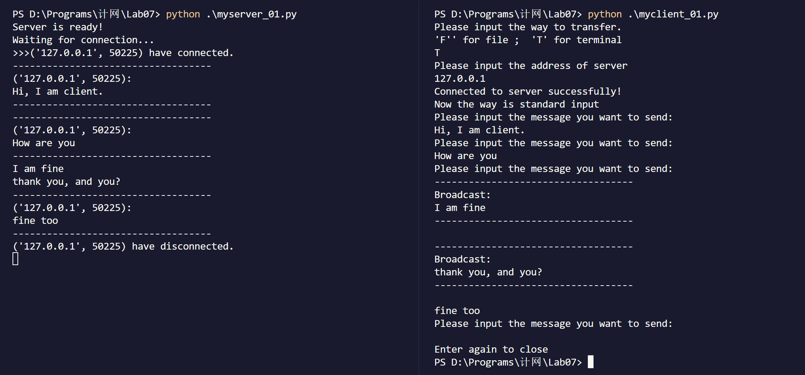

| 实验课程：计算机网络实践      | 姓名：李彤         | 学号：10235101500 |
| ----------------------------- | -------------------- | ----------------- |
| 实验名称：Lab07 Socket Programming | 实验日期：2024.01.10 | 指导老师：王廷  |

-------
**注：为了避免与期末复习冲突，本实验内容在很久很久很久之前完成。**

-----------

## 实验目的 
* 熟悉socket编程的基本原理
* 掌握简单的套接字编程
* 掌握通过socket编程实现C/S程序的基本方法
* 了解应用层和运输层的作用及相关协议的工作原理和机制

## 实验环境
* Windows
* Python

## 实验内容与实验步骤
&emsp;&emsp;在使用python实现socket编程时，我们需要先导入 **socket、threading** 库，它们分别向我们提供了：
* **socket：** 提供套接字功能，用于创建连接、发送接收数据。
* **threading：** 提供多线程支持，用于并发执行多个任务，如同时发送和接收数据。（能帮助我们实现双工通信）

## client.py
&emsp;&emsp;首先介绍一下代码的几个重要变量和主要框架：
* `port` ：端口号为 **7701** ，用于指定客户端与服务器之间的通信端口；              
* `MAX_LEN` ：为每次最多传输的字节数，这里设置为 **20KB** ，使用常量而不是硬编码的数字使得代码更具可维护性和可扩展性；
* `address` ：客户机想要连接的服务器的地址。此地址由用户决定，可以是本机地址（如 127.0.0.1 或 localhost）或远程服务器的 IP 地址；
* `way` ：通过用户输入确定传输的方式。 **'F'**  表示文件传输， **'T'**  表示终端文本传输；  
* `host` ：这是一个元组，包含服务器的地址和端口号（ `address` 和 `port`），用于 `s.connect(host)` 方法中，以便客户端能够连接到指定的服务器。

```py
port = 7701
MAX_LEN  = 20480
way = input("Please input the way to transfer.\n'F'' for file ;  'T' for terminal\n")
address = input("Please input the address of server\n")
host = (address, port)
```

&emsp;&emsp;`socket.AF_INET` 和 `socket.SOCK_STREAM` 是 `Python socket` 模块中用于定义 **套接字类型和地址族** 的常量。`socket.AF_INET` 表示使用   **IPv4** 地址族，即套接字通过 **IPv4** 协议进行通信。`socket.SOCK_STREAM` 表示使用 **TCP** 协议，即面向连接、可靠的流式通信，确保数据的顺序和完整性。因此一开始我们使用 `socket.socket(socket.AF_INET, socket.SOCK_STREAM)` 创建一个基于 IPv4 的 TCP 套接字。         
&emsp;&emsp;然后通过 `s.settimeout(5)` 设置连接超时时间为 5 秒，防止连接挂起过久。如果在指定时间内无法连接到服务器，程序会触发超时异常。`s.connect(host)` 尝试连接服务器，如果连接失败，就捕获 `socket.error` 异常并输出错误信息，程序随后终止执行。              
&emsp;&emsp;最后，代码使用多线程来实现同时进行消息传输和接收，`threading.Thread` 创建的两个线程：
* 一个线程负责调用 `transfer()` 函数，用于发送消息到服务器。
* 另一个线程负责调用 `receive()` 函数，用于接收服务器广播的消息并打印。 

&emsp;&emsp;通过多线程，客户端能够在传输消息的同时，不间断地接收服务器广播的消息，从而实现 **双工通信** 。线程的 `target` 参数指定了线程启动后执行的函数，`args=()` 表示不传递任何参数给函数。
```py
try:
    s = socket.socket(socket.AF_INET, socket.SOCK_STREAM)  # 创建套接字
    s.settimeout(5)
    s.connect(host)
except socket.error as err:
    print(err)
    exit(1)
print("Connected to server successfully!")

threading.Thread(target = transfer, args = ()).start()
threading.Thread(target = receive, args = ()).start()
```

### 向服务器发送信息
&emsp;&emsp;`transfer()` 函数用来判断用户的输入方式，并调用相应的函数。
```py
def transfer():
    if way == "F":
        file_transfer()
    elif way == "T":
        terminal_transfer()
    else:
        print("Invalid way!")
        exit(1)
    s.close()
```
&emsp;&emsp;`file_transfer()` 函数用于从用户指定的文件路径读取文件内容并将其发送给服务器。用户需要输入文件的路径，如果路径为空，程序会提示用户是否关闭传输。函数会尝试打开文件并逐行读取文件内容，然后将每一行分块发送给服务器，确保每次发送的字节数不超过 `MAX_LEN`。如果文件不存在，则会捕获 `FileNotFoundError` 异常并提示用户。                 

&emsp;&emsp;`terminal_transfer` 函数则是通过终端输入的方式发送消息。当用户输入的消息不为空时，程序会将消息分块发送给服务器，每块的大小为 `MAX_LEN` 字节。若用户输入为空，程序会继续询问是否关闭传输。如果用户继续输入消息，程序会重复此过程，直到用户输入两次回车键结束传输。

&emsp;&emsp;传输数据时使用的 `sendall()` 是 Python 的 socket 模块中的一个方法，用于向远程主机发送数据。它通常通过套接字对象来调用，而 `client_list` 中的每个客户端项包含一个连接（connection），所以可以通过该连接对象使用 `sendall()` 发送数据。与 `send()` 方法不同，`sendall()` 会 **确保将数据完全发送到目标主机** 。如果因为网络问题导致发送不完整，`sendall()` 会继续发送，直到所有数据被发送出去，或者发生错误。如果传递的是字符串，则需要先调用 `encode` 函数编码为字节串。

```py
def file_transfer():
    print("message is from file, you don't need to input anything.\n")
    while True:
            path = input("Please input the file path:\n").rstrip()
            if path == "":
                if input("Try >Enter< again to close") == "":
                    break
                else:
                    continue
                
            try:
                f = open(path, encoding = "UTF-8")
                message = f.readlines()
                f.close()
                for line in message:
                    if line == "":
                        continue
                    i = 0
                    while len(line) - i >= MAX_LEN:
                        s.sendall(line[i:i + MAX_LEN].encode())
                        i += MAX_LEN
                    s.sendall(line[i:].encode())
            except FileNotFoundError:
                print(f"File not found: {path}")
                continue
    

def terminal_transfer():
    print("Now the way is standard input")
    while True:
        message = input("Please input the message you want to send:\n").rstrip()
        if message == "":
            if input("Enter again to close") == "":
                break
            else:
                continue
        i = 0
        while len(message) - i >= MAX_LEN:
            s.sendall(message[i:i + MAX_LEN].encode())
            i += MAX_LEN
        s.sendall(message[i:].encode())
```

### 从服务器接收信息
&emsp;&emsp;`receive()`函数用于持续接收服务器的消息，并在接收到消息后打印出来。如果发生异常（如超时或连接问题），则终止接收过程。           
`recv` 是 `Python socket` 模块中用于从套接字接收数据的方法，由于它返回的是一个字节对象（byte类型），所以我们还要调用 `decode()` 函数将其解码为字符串。
```py
def receive():
    while True:
        try:
            s.settimeout(1000)  # 设置接收消息的超时限制
            message = s.recv(MAX_LEN).decode()  # 接收服务器发来的消息
            print("-----------------------------------")
            print(f"Broadcast:\n{message}")  # 打印接收到的广播消息
            print("-----------------------------------\n")
        except:
            break
```
[client.py完整代码](#client完整代码)
## server.py
&emsp;&emsp;同client相比，server的代码更简单，主要功能就是接收客户端发来的消息，并将消息广播给所有客户端。
* `client_list = []` 用于存储所有已连接的客户端信息，每当一个客户端连接到服务器时，服务器会将其添加到该列表中；
* `lk = threading.Lock()` 是一个用于同步访问 `client_list` 的锁，确保在多线程环境下，多个线程安全地访问和修改客户端列表，避免数据竞争。
* `MAX_CLIENTS = 10` 和 `s.listen(MAX_CLIENTS)` 操作设置了服务器能够接受的最大客户端连接数。如果有更多的客户端尝试连接，服务器将拒绝新的连接请求。          

&emsp;&emsp;然后 `threading.Thread(target = broadcast, args = ()).start()` 启动一个独立的线程，持续负责广播消息，确保所有客户端接收到消息。在while循环中，服务器通过 `s.accept()` 等待并接受客户端连接，每当一个新客户端连接时，服务器就会创建一个新的线程来处理与该客户端的通信和消息接收逻辑，实现并发处理多个客户端的连接和交互。
```py
client_list = []        # 存储所有已连接的客户端信息
lk = threading.Lock()   # 用于同步客户端列表的访问
MAX_CLIENTS = 10        # 最大连接客户机数

port = 7701  
MAX_LEN  = 20480

try:
    s = socket.socket(socket.AF_INET, socket.SOCK_STREAM)
    host = ('', port)
    s.bind(host)
    s.listen(MAX_CLIENTS)
except socket.error as err:
    print(err)
    exit(1)
print("Server is ready!")
print("Waiting for connection...")

threading.Thread(target = broadcast, args = ()).start()
while True:
    (connection, address) = s.accept()
    threading.Thread(target = reception, args = ()).start()
```

### 服务器发送广播信息
&emsp;&emsp;`broadcast` 函数用于不断地从服务器端接收输入的消息并将其广播给 **所有已连接** 的客户端。
`rstrip()` 用于移除字符串末尾的空白字符（包括空格、换行符 \n 和制表符 \t 等）。
```py
def broadcast():
    while True:
        message = input().rstrip()
        if message == "":
            continue
        for c in client_list:
            i = 0
            while len(message) - i >= MAX_LEN:
                c[2].sendall(message[i : i + MAX_LEN].encode())
                i += MAX_LEN
            c[2].sendall(message[i:].encode())
```
### 服务器接收客户端信息
&emsp;&emsp;`reception` 函数负责处理每个客户端的连接。当客户端连接到服务器时，函数将其信息（IP 地址、端口和连接对象）添加到 client_list 并打印连接提示。在一个无限循环中，函数不断接收客户端发送的消息，如果发生异常（如连接断开），则移除该客户端并关闭连接。如果收到有效消息，函数会打印客户端发送的消息并继续等待下一条消息。
```py
def reception():
    client = (address[0], address[1], connection)
    client_list.append(client)
    print(f">>>{client[0:2]} have connected.")
    while True:
        try:
            message = connection.recv(MAX_LEN).decode()
        except Exception:
            lk.acquire()
            client_list.remove(client)
            lk.release()
            print(f"{client[0:2]} have disconnected.")
        if message == '':
            print(f"{client[0:2]} have disconnected.")
            break
        else:
            print("-----------------------------------")
            print(f"{client[0:2]}:\n{message}")
            print("-----------------------------------")
    lk.acquire()
    client_list.remove(client)
    lk.release()
    connection.close()
```
[server.py完整代码](#serverpy完整代码)

## 测试
### 终端输入


### 文件输入
&emsp;&emsp;在记事本中随便输入一点内容，用于测试。


## 心得体会
&emsp;&emsp;在这个实验中，我深入学习了Python的socket编程，掌握了客户端和服务器端的基本通信原理，尤其是通过TCP协议进行数据传输和双向通信。实验中，我使用多线程技术实现了同时发送和接收消息，能够理解并处理网络通信中的并发问题。通过实践，我加深了对应用层和传输层协议（如TCP/IP协议）的理解，也对客户端与服务器之间如何通过套接字建立连接和交换数据有了更清晰的认识。此外，设计并实现了基于文件和终端输入的不同消息传输方式，让我体会到socket编程在实际应用中的灵活性与强大功能。

<div STYLE="page-break-after: always;"></div>

## client完整代码
```py
import socket
import threading

def file_transfer():
    print("message is from file, you don't need to input anything.\n")
    while True:
            path = input("Please input the file path:\n").rstrip()
            if path == "":
                if input("Try >Enter< again to close") == "":
                    break
                else:
                    continue
                
            try:
                f = open(path, encoding = "UTF-8")
                message = f.readlines()
                f.close()
                for line in message:
                    if line == "":
                        continue
                    i = 0
                    while len(line) - i >= MAX_LEN:
                        s.sendall(line[i:i + MAX_LEN].encode())
                        i += MAX_LEN
                    s.sendall(line[i:].encode())
            except FileNotFoundError:
                print(f"File not found: {path}")
                continue
    

def terminal_transfer():
    print("Now the way is standard input")
    while True:
        message = input("Please input the message you want to send:\n").rstrip()
        if message == "":
            if input("Enter again to close") == "":
                break
            else:
                continue
        i = 0
        while len(message) - i >= MAX_LEN:
            s.sendall(message[i:i + MAX_LEN].encode())
            i += MAX_LEN
        s.sendall(message[i:].encode())

def transfer():
    if way == "F":
        file_transfer()
    elif way == "T":
        terminal_transfer()
    else:
        print("Invalid way!")
        exit(1)
    s.close()

def receive():
    while True:
        try:
            s.settimeout(1000)
            message = s.recv(MAX_LEN).decode()
            print("-----------------------------------")
            print(f"Broadcast:\n{message}")
            print("-----------------------------------\n")
        except:
            break

port = 7701
MAX_LEN  = 20480 
way = input("Please input the way to transfer.\n'F'' for file ;  'T' for terminal\n")
address = input("Please input the address of server\n")
host = (address, port) 

try:
    s = socket.socket(socket.AF_INET, socket.SOCK_STREAM)
    s.settimeout(5)
    s.connect(host)
except socket.error as err:
    print(err)
    exit(1)
print("Connected to server successfully!")

threading.Thread(target = transfer, args = ()).start()
threading.Thread(target = receive, args = ()).start()
```

## server.py完整代码
```py
import socket
import threading

def broadcast():
    while True:
        message = input().rstrip()
        if message == "":
            continue
        for c in client_list:
            i = 0
            while len(message) - i >= MAX_LEN:
                c[2].sendall(message[i : i + MAX_LEN].encode())
                i += MAX_LEN
            c[2].sendall(message[i:].encode())

def reception():
    client = (address[0], address[1], connection)
    client_list.append(client)
    print(f">>>{client[0:2]} have connected.")
    while True:
        try:
            message = connection.recv(MAX_LEN).decode()
        except Exception:
            lk.acquire()
            client_list.remove(client)
            lk.release()
            print(f"{client[0:2]} have disconnected.")
        if message == '':
            print(f"{client[0:2]} have disconnected.")
            break
        else:
            print("-----------------------------------")
            print(f"{client[0:2]}:\n{message}")
            print("-----------------------------------")
    lk.acquire()
    client_list.remove(client)
    lk.release()
    connection.close()


client_list = []        # 存储所有已连接的客户端信息
lk = threading.Lock()   # 用于同步客户端列表的访问
MAX_CLIENTS = 10

port = 7701             # 端口号
MAX_LEN  = 20480        # 每次最多传输的字节数 —— 20KB

try:
    s = socket.socket(socket.AF_INET, socket.SOCK_STREAM)
    host = ('', port)
    s.bind(host)
    # 最大客户端数
    s.listen(MAX_CLIENTS)
except socket.error as err:
    print(err)
    exit(1)
print("Server is ready!")
print("Waiting for connection...")

threading.Thread(target = broadcast, args = ()).start()
while True:
    (connection, address) = s.accept()
    threading.Thread(target = reception, args = ()).start()
```